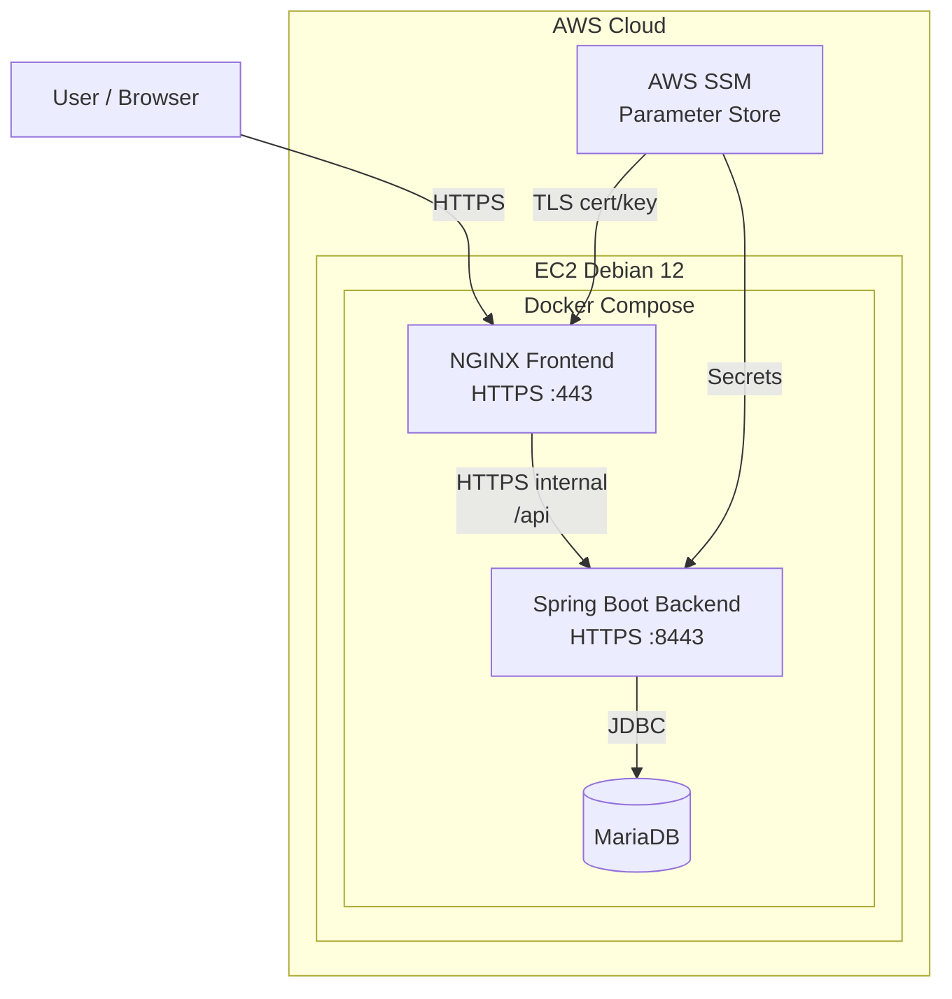

# DeslocaFácil - Corporate Mobility System

## 📋 About the Project

Corporate mobility system MVP developed for the **Hackathon 2025 +Devs2Blu by Blusoft**, which manages employee travel for events, training, and onboarding.

##### **RESULT OF THE 5th EDITION OF HACKATON +Devs2Blu: 4th place among 14 participating groups!**

### Challenge

Companies that receive employees from other cities/states face difficulties with:
- Tracking travel in real time
- Predicting delays and estimating costs
- Organizing arrival times
- Consolidating travel history

### Solution

Centralized system that allows:
- ✅ Register employee travel
- ✅ Organize routes and schedules
- ✅ Monitor arrival status
- ✅ Display routes with Google Maps integration
- ✅ Check-in at checkpoints
- ✅ Analyze history for cost forecasting

---

## 🗃️ Architecture

### Tech Stack

**Backend:**
- Java 21+
- Spring Boot 3.5.3
- Spring Security (session-based authentication + CSRF)
- Spring Data JPA
- MySQL 8.0
- ModelMapper

**Frontend:**
- HTML5, CSS3, JavaScript (Vanilla)
- Bootstrap 5.3
- Font Awesome
- MPA Architecture (Multi-Page Application)

**Infrastructure:**
- Maven
- Docker 
- Docker Compose
- Terraform
- AWS EC2

---

## 📊 Data Model

### Main Entities

#### Usuario (User)
Employees who travel.
```
- id (PK)
- nome (name)
- email (UK)
- senha (password - BCrypt)
- telefone (phone)
- ativo (active)
- role (ADMIN, USUARIO)
- auditoria (audit: creation_date, modification_date, created_by, modified_by)
```

#### Deslocamento (Travel)
Corporate trip records.
```
- id (PK)
- usuario_id (FK)
- origem (origin: city, state, address)
- destino (destination: city, state, address)
- motivo (reason)
- datas (dates: departure, expected_arrival, actual_arrival)
- meio_transporte (transport_method - ENUM)
- custos (costs: estimated, actual)
- status (PLANEJADO, EM_TRANSITO, ATRASADO, CONCLUIDO, CANCELADO)
- observacoes (notes)
- auditoria (audit)
```

#### Checkpoint
Control points along the route.
```
- id (PK)
- deslocamento_id (FK, CASCADE)
- descricao (description)
- categoria (category: PARTIDA, INTERMEDIARIO, CHEGADA)
- localizacao (location)
- datas (dates: expected, completed)
- ordem_sugerida (suggested_order)
- icone, cor (icon, color - for UI)
- observacoes (notes)
- auditoria (audit)
```

### Relationships
- `Usuario` 1:N `Deslocamento`
- `Deslocamento` 1:N `Checkpoint` (ON DELETE CASCADE)

---

## 🔐 Security

### Authentication
- Session-based authentication (JSESSIONID)
- Passwords: BCrypt
- CSRF Protection (Cookie + Header)
- HTTPS required (requiresSecure)

### Role-Based Authorization

- ADMIN users can create, edit and view travel. Create, delete, modify checkpoints, activate and deactivate users.
- USUARIO users can add checkpoints to their active travel and modify their user data.


## 📁 Project Structure

```
deslocafacil/
├── backend/
│   └── src/main/java/edu/entra21/fiberguardian/
│       ├── assembler/          # DTOs assemblers/disassemblers
│       ├── configuration/      # Security, CORS, JPA, ModelMapper
│       ├── controller/         # REST endpoints
│       ├── dto/                # Data Transfer Objects
│       ├── exception/          # Exception handlers
│       ├── input/              # Request input models
│       ├── model/              # JPA Entities
│       ├── repository/         # Spring Data repositories
│       ├── service/            # Business logic
│       └── validation/         # Custom validators
├── frontend/
│   ├── assets/
│   │   ├── css/
│   │   ├── js/
│   │   └── img/
│   ├── index.html
│   └── tela_principal.html
└── database/
    └── SQL scripts
```

---

## 📌 API Endpoints

### Authentication

#### Login
```http
POST /api/fg-login
Content-Type: application/json

{
  "email": "user@example.com",
  "senha": "senha123"
}
```

#### Logout
```http
POST /api/fg-logout
Cookie: JSESSIONID=xxx
```

#### CSRF Token
```http
GET /api/csrf-token
```

### Users

#### Create User (ADMIN)
```http
POST /api/usuarios
X-XSRF-TOKEN: xxx

{
  "nome": "João Silva",
  "email": "joao@example.com",
  "role": "USUARIO",
  "senha": "senha123",
  "repeteSenha": "senha123"
}
```

#### List Users (Paginated)
```http
GET /api/usuarios?page=0&size=20
```

#### Search by Name and Role
```http
GET /api/usuarios/lista-usuario-por-role?nome=João&role=USUARIO
```

#### Update Own Data
```http
PUT /api/usuarios/me/nome
X-XSRF-TOKEN: xxx

{
  "nome": "João Silva Santos",
  "telefone": "(47) 99999-9999"
}
```

#### Change Password
```http
PUT /api/usuarios/me/senha
X-XSRF-TOKEN: xxx

{
  "senhaAtual": "senha123",
  "novaSenha": "novaSenha456",
  "repeteNovaSenha": "novaSenha456"
}
```

#### Activate/Deactivate User (ADMIN)
```http
PUT /api/ativo
X-XSRF-TOKEN: xxx

{
  "email": "user@example.com"
}
```

```http
DELETE /api/ativo
X-XSRF-TOKEN: xxx

{
  "email": "user@example.com"
}
```

### Travel (IN DEVELOPMENT)

```
POST   /api/deslocamentos          # Create travel
GET    /api/deslocamentos          # List all
GET    /api/deslocamentos/{id}     # Get by ID
PUT    /api/deslocamentos/{id}     # Update
DELETE /api/deslocamentos/{id}     # Cancel
GET    /api/deslocamentos/ativos   # List in transit/delayed
```

---

### Checkpoints (IN DEVELOPMENT)

```
POST   /api/checkpoints                    # Create checkpoint
GET    /api/checkpoints/deslocamento/{id}  # List by travel
POST   /api/checkpoints/{id}/checkin       # Check-in
PUT    /api/checkpoints/{id}               # Update
```

---

## 🎯 Implemented Features

### ✅ Done
- [x] Authentication and authorization (Session + CSRF)
- [x] User CRUD
- [x] Role management (ADMIN, USUARIO)
- [x] Custom validations (email, password)
- [x] Global exception handling
- [x] Automatic auditing (JPA Auditing)
- [x] Base frontend (main screen, login)
- [x] Travel CRUD
- [x] Dynamic travel queries using filters
- [x] Google Maps integration

### 🚧 In Development (Mocks)

- [ ] Checkpoint CRUD
- [ ] Tracking dashboard
- [ ] Google Maps integration
- [ ] Check-in system
- [ ] Reports and cost analysis

---

## 🗺️ Google Maps Integration

### Route Visualization

The system uses **Google Maps Directions URL** to display routes without needing an API Key:

```javascript
const url = `https://www.google.com/maps/dir/?api=1&origin=${origem}&destination=${destino}`;
window.open(url, '_blank');
```

---

### Checkpoint Strategy

For travel with multiple intermediate checkpoints, the system generates sequential links:

```
Checkpoint 1 (DEPARTURE) → Checkpoint 2 (INTERMEDIATE)
Checkpoint 2 → Checkpoint 3 (INTERMEDIATE)
Checkpoint 3 → Checkpoint 4 (ARRIVAL)
```

Each segment can be viewed individually on Google Maps.

---

## 🔍 Custom Validations

### @EmailValido
```java
@NotBlank(message = "Email is required")
@Email(message = "Email must be valid")
@Size(max = 50, message = "Email must be up to 50 characters")
```
---

### @SenhaValida
```java
@NotBlank(message = "Password is required")
@Size(min = 6, max = 20, message = "Password must be between 6 and 20 characters")
```
---

# 🐳 Container Build and Docker Architecture

The application runs 100% containerized, using **Docker** + **Docker Compose** for orchestration. The architecture has three main services:

```
mariadb ← backend (Spring Boot) ← frontend (NGINX + TLS)
```

## Backend (Multi-stage Dockerfile)

The backend uses **multi-stage build** to reduce size and improve security:

### 🔨 Stage 1 — Build

* Base: `maven:3.9-eclipse-temurin-21`
* Compiles project and generates fat-JAR via Maven

### 🚀 Stage 2 — Runtime

* Base: `eclipse-temurin:21-jre-jammy`
* Copies final JAR
* Exposes port `8443`
* Runs via `java -jar`


Motivation: separate build and runtime dependencies → smaller, more secure images.

---

## Frontend (NGINX + Real TLS)

The frontend image:

* Uses `nginx:alpine`
* Serves static HTML/JS/CSS files
* Automatically receives via user-data:

  * `cert.pem`
  * `key.pem`
* Configures NGINX to serve on **native HTTPS (port 443)**
* Removes default config and applies custom `nginx.conf`


### nginx.conf — Secure Reverse Proxy with TLS

The frontend proxies to the backend like this:

* Frontend at: `https://ec2/`
* Backend at: `https://deslocafacil-backend:8443/api/...`

Main components:

* Dynamic resolution via `resolver 127.0.0.11` (Docker internal DNS)
* `proxy_ssl_verify off` to allow internal self-signed TLS
* Correct header forwarding (`X-Forwarded-*`)


Motivation: end-to-end security, including inside the Docker network.

---

## Docker Compose — Full Orchestration

The `docker-compose.yml` defines 3 services:

### 🔌 mariadb

* Stores persisted data
* Dedicated volume `db_data`
* Only backend has access to it


### 🔌 backend

* Build via Dockerfile
* Reads sensitive variables from `.env` generated via SSM
* Includes paths to keys/certificates
* Automatic restart `restart: unless-stopped`
* Exposes `8443` to NGINX


### 🔌 frontend

* Build from NGINX Dockerfile
* Depends on backend
* Exposes port `443` to the world
* Serves static site
* Secure proxy to backend


Motivation: clean, three-tier architecture, fully isolated:

```
[User] → HTTPS → [NGINX Frontend] → HTTPS → [Spring Boot] → [MariaDB]
```

---

# 🏭 Infrastructure (AWS + Terraform)

The infrastructure is provisioned via **Terraform**, ensuring reproducibility, minimal operational effort, and centralized security via IAM + SSM Parameter Store.
It automatically creates:

### 🔒 Network and Security

* **Dedicated Security Group** allowing only:

  * `22` (SSH)
  * `8443` (Spring Boot backend with TLS)
  * `443` (NGINX frontend with TLS)
    All outbound traffic is allowed for updates, cloning, SSM, etc.


### 🧩 IAM and Secure Secret Access

* Creation of an **exclusive IAM Role** for EC2.
* Allows access only to the secure parameter prefix in SSM:
  `/hackaton-devs2blu/backend/*`
* Policies for **decrypt via KMS** and reading sensitive parameters:

  * Database credentials
  * Flyway credentials
  * Keystore passwords
  * SSL certificates (Key + Cert)


### 🖥️ Automated EC2 with User Data

The EC2 instance (Debian 12) is created with:

* Docker Engine + Compose installed
* Java 21 and Maven
* AWS CLI
* Automatic repository clone
* Secure TLS certificate download via SSM
* Correction, revalidation and normalization of PEM format
* Dynamic `.env` file creation
* Automatic backend build (`mvn clean package`)
* Execution of `docker compose up -d`


### LocalizaFacil System Infrastructure Architecture (AWS)




### ✓ Infrastructure Goal

Produce a fully **self-managed** environment, where launching a new EC2 already delivers:

* Valid certificates
* Sensitive variables loaded
* Compiled backend
* Running containers
* Frontend and API exposed on HTTPS

## 👥 Team

Project developed for **Hackathon 2025 +Devs2Blu**.
- Angelo Balotin Mattos
- Cauê França
- Daniel Greenwod
- Danyel Pinheiro
- Giovanni Leopoldo Rozza

---

## 📄 License

This project was developed for educational purposes in the context of the Blusoft Hackathon.

---

## 🔗 Useful Links

- [Spring Boot Documentation](https://spring.io/projects/spring-boot)
- [Bootstrap 5 Docs](https://getbootstrap.com/docs/5.3/)
- [Google Maps Platform](https://developers.google.com/maps)

---

**Project Status:** 🚧 In Development (MVP)
